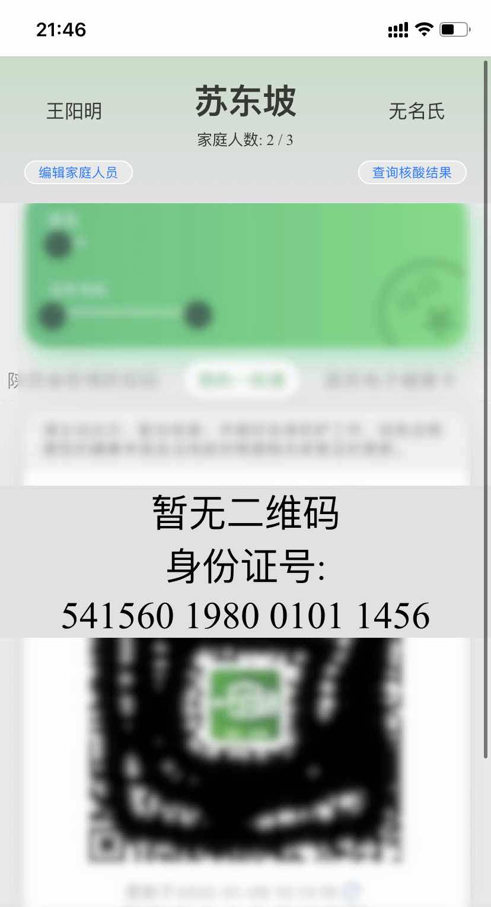
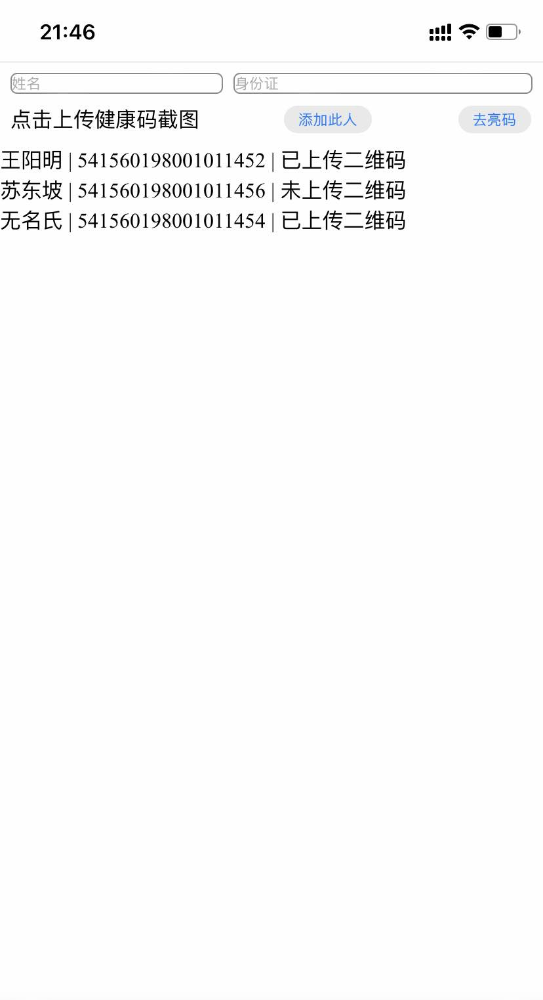

# Family nucleic acid test
## 家庭核酸检测

> 西安疫情期间，居家隔离，封门，防疫人员上门做核酸。
> 
> 西安一码通，二维码暂不过期，防疫人员建议 由一个人保存所有家人的一码通截图，他们逐一扫码，无需每个人拿手机过来，以此加快效率。
> 
> 遂，做了个这个小页面。

## 功能

- 编辑家庭人员，数据图片本地保存，离线使用
- 滑动顺序展示二维码
- 在线/本地 查看核酸结果

## use [Cloudflare Worker](https://developers.cloudflare.com/workers/) to proxy api
```
wrangler secret put API_TOKEN
wrangler secret put NAAT_UUID
wrangler secret put NAAT_PRIVATE_KEY

// cp & edit wrangler.toml
cp wrangler.toml.template wrangler.toml

wrangler publish
```

## use [腾讯云 云函数](https://cloud.tencent.com/document/product/583) to proxy api
Environment Variables
```
API_TOKEN=
PRIVATE_KEY=
UUID=
```
Code: `tencent-scf/index.js`

## 本地批量查询结果
```
// cp & edit data.js
cp data.js.template data.js

node get-result.js
```


