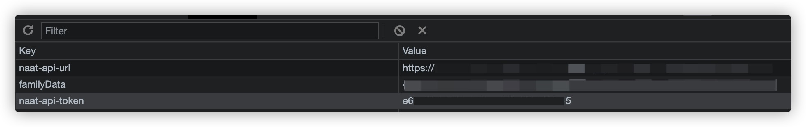
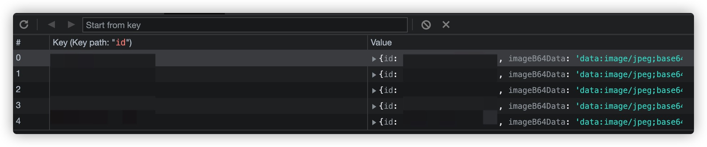
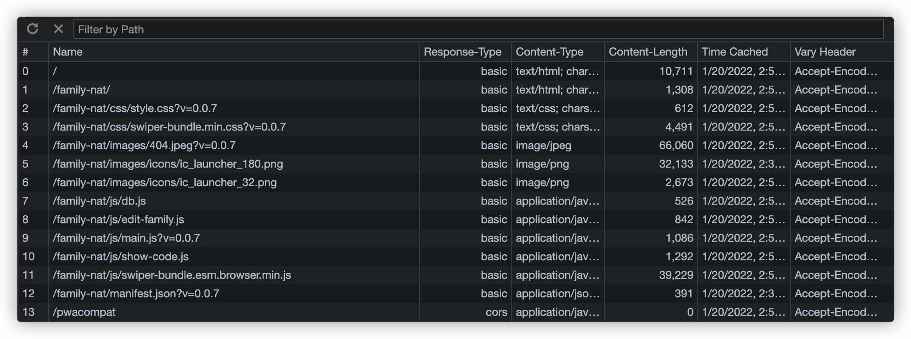
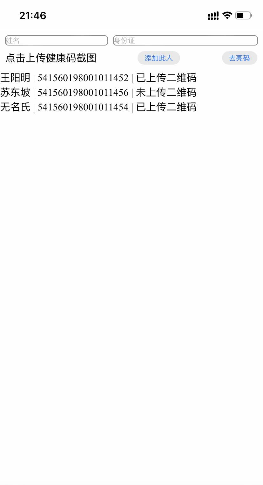

# Family nucleic acid test
## 家庭核酸检测

> 西安疫情期间，居家隔离，封门，防疫人员上门做核酸。
> 
> 西安一码通，二维码暂不过期，防疫人员建议 由一个人保存所有家人的一码通截图，他们逐一扫码，无需每个人拿手机过来，以此加快效率。
> 
> 遂，做了个这个小页面。


## Features
- 编辑家庭人员，数据图片本地保存，离线使用
- 滑动顺序展示二维码
- 在线 / 本地 查看核酸结果


## Use [Cloudflare Worker](https://developers.cloudflare.com/workers/) to proxy api
```bash
wrangler secret put API_TOKEN
wrangler secret put NAAT_UUID
wrangler secret put NAAT_PRIVATE_KEY


cd packages/cloudflare-worker

// cp & edit wrangler.toml
cp wrangler.toml.template wrangler.toml

wrangler publish
```


## Use [腾讯云 云函数](https://cloud.tencent.com/document/product/583) to proxy api
Environment Variables
```
API_TOKEN=
NAAT_PRIVATE_KEY=
NAAT_UUID=
```
Code: `packages/tencent-scf/index.js`


## Environment Variables Description
### Server-side Variables
- `API_TOKEN`

  [Officially API](https://yqpt.xa.gov.cn/prod-api/naat/open/api/getResultByCardNumAndName) can not be called across domain, so we need a self host proxy e.g. [Cloudflare Worker](https://developers.cloudflare.com/workers/), [Tencent SCF](https://cloud.tencent.com/document/product/583). API_TOKEN is a simple authentication to access this service.

- `NAAT_PRIVATE_KEY`
- `NAAT_UUID`

  Officially using front-end signature The `uuid` and `private key` required for the signature are hard code in the [JavaScript file](https://yqpt.xa.gov.cn/nrt/js/request-sign.min.js?y=202201170330), I had to hide it.


### Local Storage
- `naat-api-url`: 
  
  self host proxy server URL

- `naat-api-token`: 
  
  `API_TOKEN` also need to save a copy on the front end

- `familyData`: 
  
  Family Personnel Data Structure
  ```javascript
  { "541560198001011452": { name: "王守仁", noQRCode: false, id: "541560198001011452" } } 
  ```


### IndexedDB
```
Key: "541560198001011452"
Value: { id: "541560198001011452", imageB64Data: "data:image/jpeg;base64}
```

## Local bulk check results
```bash
cd packages/cmd
// cp & edit data.js
cp data.js.template data.js

node get-result.js
```


## Practice technical points
- Progressive Web Apps
  - Service Worker
- JavaScript modules via script tag
- IndexedDB
- CloudFlare Worker
  - ES Module
- Tencent SCF
- Javascript / Node Crypto
- Pure JavaScript DOM basic operations


TODO:
- Use Vue or React.js
  - In the non-simple business pure JavasScript processing DOM is still not as easy as the framework
- Use UI Library for beautiful UI
- WeChat Mini Program


## Storage Usage
- Local Storage

- IndexedDB

- Cache Storage



## Screenshot

